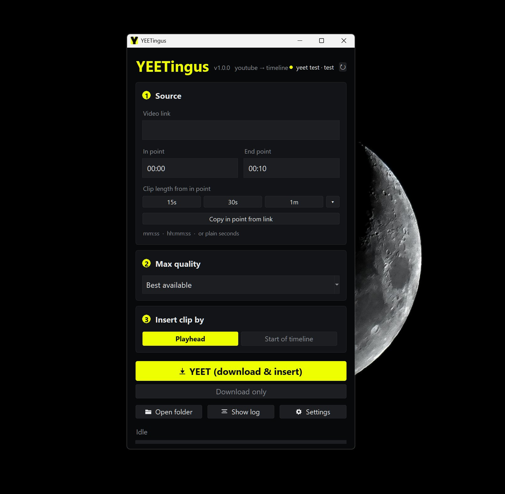

<div align="center">


# YEETingus

**Grab any slice of a YouTube video or Twitch clip and drop it straight onto your DaVinci Resolve timeline.**

Paste a link, set an in and out point, hit one button. No browser, no downloads folder
shuffling, no manual importing.


</div>

---

## 📖 Table of contents

- [What it does](#-what-it-does)
- [Features](#-features)
- [Requirements](#-requirements)
- [Installation](#-installation)
- [ffmpeg on macOS](#-ffmpeg-on-macos)
- [The JavaScript runtime](#-the-javascript-runtime)
- [Antivirus false positives](#-antivirus-false-positives)
- [Gatekeeper on macOS](#-gatekeeper-on-macos)
- [How to use it](#-how-to-use-it)
- [Settings](#-settings)
- [Where clips are saved](#-where-clips-are-saved)
- [Codecs and smooth playback](#-codecs-and-smooth-playback)
- [How it works](#-how-it-works)
- [Troubleshooting](#-troubleshooting)
- [Known limitations](#-known-limitations)
- [Legal](#-legal)
- [License](#-license)
- [How this was built](#-how-this-was-built)
- [Credits](#-credits)

---

## 🎬 What it does

Editing something that needs a clip of a YouTube video or Twitch stream for reference,
commentary or review? The usual routine is: open a browser, find a downloader, grab
the whole video, trim it, import it, drag it to the timeline.

YEETingus collapses that into one window. It downloads **only the seconds you
asked for** — not the whole video — and hands the clip to Resolve at your playhead.

Built for DaVinci Resolve, where no equivalent tool existed.

<div align="center">
  
</div>

---

## ✨ Features

### 🎯 Precise clipping

- **Time-ranged downloads** — only the requested section is fetched, so a 20-second
  clip from a 3-hour stream takes seconds, not a full download
- **Frame-accurate cuts** — uses `--force-keyframes-at-cuts`, so your in/out points
  land where you set them instead of snapping to the nearest keyframe
- **Flexible timestamps** — type `90`, `1:30` or `00:01:30`, whichever you prefer
- **📼 Or grab the whole thing** — leave **both** points at `00:00` and the entire
  video is downloaded, no section trimming. The **Entire** button clears them for you.
- **⏱️ Clip length shortcuts** — `15s` · `30s` · `90s` · `Entire`, plus a dropdown for
  2 / 5 / 10 minutes. Each sets the end point relative to your in point.
- **🔗 Timestamps detected automatically** — paste a share link with a `?t=` value and
  the in point fills itself in, no button press. `169`, `169s`, `2m49s`, `1h2m3s`,
  `start=` and `#t=` are all understood. **Copy in point from link** remains as a
  manual override.
- **🪄 The end point follows** — type an in point and click away (or press Enter) and
  the end is set to your [default clip length](#-settings). It only recalculates when
  the in point actually changed, so an end point you set deliberately is never wiped.

### 🎥 Resolve integration

- **Insert at playhead** or at the **start of the timeline**, your choice
- **Live connection status** — a tinted pill in the header shows the connected project
  and timeline, and tells you *which* piece is missing when something's wrong
  (Resolve absent vs. no project vs. no timeline)
- **Always lands on the live playhead** — the position is read at the moment of
  insertion, so you never have to refresh anything first
- **Launches from Resolve** — appears under `Workspace → Scripts → Utility`
- **📥 Download only** — skip the timeline entirely and just keep the file; works
  even with Resolve closed

### 🎛️ Quality control

- **Quality picker** — Best available (default), 2160p, 1440p, 1080p, 720p, 480p
- **Honest about what exists** — the app reads which resolutions the video actually
  offers and tells you, instead of failing on a request the video can't satisfy
- **Smart codec preference** — prefers H.264 (which scrubs smoothly in Resolve)
  *without* costing you resolution
- **Real quality readout** — after each clip, the actual resolution, codec and frame
  rate are reported, read from the file itself rather than assumed

### 🗂️ Sensible file handling

- **Descriptive folders** — `<VIDEO ID> - <title> - <channel>`
- **Never overwrites** — clips are numbered from what's already on disk, so repeated
  grabs from the same video pile up safely
- **♻️ Whole videos are reused** — a full download is saved once as `…-full` and a
  repeat request returns instantly instead of fetching it again. Interrupted
  attempts are never mistaken for finished ones.
- **Bulletproof names** — emoji, symbols and characters Windows rejects are stripped,
  while accented and CJK titles stay readable
- **Saved somewhere sensible** — your **Videos** folder by default (not `%TEMP%`,
  which the OS may empty), configurable with a **Reset** button to get the default
  back

### 🧰 Quality of life

- **⏹️ STOP mid-job** — cancels the download, kills the whole process tree and cleans
  up the partial files
- **📊 Progress with real percentages** — parsed from the downloader, with clear
  phases: reading info → downloading → merging → pasting
- **📜 Collapsible log** — hidden by default; **Show log** docks it beside the controls
  and widens the window, so it never covers or shifts anything. It keeps recording
  while hidden, and opens itself automatically if something fails
- **🖥️ Scales with your display** — reads the system DPI, so the whole UI stays
  proportionate on 1080p and 4K alike rather than shrinking to a postage stamp
- **🌒 Dark title bar** — on Windows the native title bar is themed to match,
  instead of a white strip above a near-black window (macOS offers no equivalent
  API, so there it follows the system appearance)
- **🔄 Self-updating downloader** — an **Update yt-dlp** button, because YouTube
  changes things and breakage is a matter of when, not if
- **📦 Zero-dependency setup** — yt-dlp and ffmpeg are fetched automatically on first
  run; no Python needed to *run* the app

---

## 📋 Requirements

| | |
|---|---|
| 🖥️ **OS** | Windows, or macOS on **Apple Silicon** |
| 🎬 **DaVinci Resolve** | Studio, running, with a project and timeline open |
| 🔓 **Scripting enabled** | `Preferences → System → General → External scripting using` → **Local** |
| 🐍 **Python** | **Only to build it** — 3.6–3.13 (see [note](#the-python-version-constraint)) |
| 📥 **yt-dlp** | Fetched automatically on first run |
| 🎞️ **ffmpeg** | Automatic on Windows · **`brew install ffmpeg`** on macOS ([why](#-ffmpeg-on-macos)) |
| 🟢 **JS runtime** | Deno, fetched automatically on first run ([why](#-the-javascript-runtime)) |

> [!IMPORTANT]
> Enabling external scripting is not optional — without it, Resolve won't accept
> connections and the app can't insert anything.

> [!NOTE]
> Blackmagic's own scripting docs state the API covers both the free and Studio
> versions, but external scripting on the free version is untested here. Studio is
> the supported configuration.

---

## 📦 Installation

There's no installer yet — you build it once, then install it.

**Windows**

```bash
git clone https://github.com/hajdawery/yeetingus.git
cd yeetingus

py -3.13 build.py      # creates dist\YEETingus.exe  (~11 MB)
py -3.13 install.py    # installs it + adds the Resolve menu entry
```

**macOS**

```bash
git clone https://github.com/hajdawery/yeetingus.git
cd yeetingus

brew install ffmpeg      # see "ffmpeg on macOS" below — this one is on you
python3.13 build.py      # creates dist/YEETingus.app
python3.13 install.py    # installs it + adds the Resolve menu entry
```

Then **restart DaVinci Resolve**.

What changed between versions is in the [changelog](CHANGELOG.md).

> [!WARNING]
> Restarting Resolve is required, not optional. Resolve caches the launcher script
> when it builds the Scripts menu, so until you restart it keeps running the old one.

> [!IMPORTANT]
> **Windows Defender may flag the pre-built binaries as a false positive.** This is
> normal for PyInstaller applications and is explained in full under
> [Antivirus false positives](#-antivirus-false-positives) — including how to verify
> the files, and how to avoid pre-built binaries entirely by building from source.

The installer prints a verification block listing exactly what it wrote, and fails
loudly if anything is missing rather than claiming success.

<details>
<summary><b>Running from source instead</b></summary>

```bash
py -3.13 backend\yeet_app.py          # Windows: just run it
py -3.13 install.py --dev             # or point the Resolve menu entry at your source copy

python3.13 backend/yeet_app.py        # macOS: just run it
python3.13 install.py --dev           # or point the Resolve menu entry at your source copy
```

`--dev` bakes your source path into the launcher, so the menu entry runs your working
copy with no built app involved. Re-run it if you move the project.

> [!NOTE]
> **macOS, running from source:** the python.org builds ship no CA bundle, so
> downloads fail with `CERTIFICATE_VERIFY_FAILED` until you run
> `/Applications/Python 3.13/Install Certificates.command`. YEETingus falls back
> to the system trust store at `/etc/ssl/cert.pem` if you haven't, so this
> usually just works — but that's the fix if it doesn't.

</details>

<details>
<summary><b>Upgrading from the old "YEET" version</b></summary>

`install.py` handles it automatically. The downloaded tool cache (yt-dlp + ffmpeg) and
your `settings.json` are moved to the new folder, and the old exe, shim and menu entry
are deleted so Resolve doesn't list two entries. Nothing is re-downloaded and no
settings are lost.

</details>

<details id="the-python-version-constraint">
<summary><b>Why Python 3.6–3.13 (and why it doesn't matter to users)</b></summary>

Resolve's `fusionscript.dll` is a version-specific CPython C extension, so it only
loads into an interpreter matching its ABI. Blackmagic's docs claim "3.6+", but the
real ceiling lags new Python releases until they rebuild it.

Tested against Resolve's June 2026 library:

| Python | Result |
|---|---|
| 3.11 | ✅ loads |
| 3.13 | ✅ loads |
| 3.14 | ❌ segfault |

The built exe **embeds its own interpreter**, so anyone *running* YEETingus needs no
Python at all. This only affects building and running from source. `build.py` refuses
to run on an unsupported version rather than producing a broken exe, and
`resolve_bridge.MAX_PY` is the single constant to bump once a newer Python works.

</details>

---

## 🎞️ ffmpeg on macOS

On Windows, YEETingus downloads ffmpeg for you on first run. **On macOS it
doesn't, and that's deliberate.**

```bash
brew install ffmpeg
```

**Why the difference.** Windows has an obvious, trustworthy source: yt-dlp
maintains [FFmpeg-Builds](https://github.com/yt-dlp/FFmpeg-Builds), the exact
builds yt-dlp is tested against. macOS has no equivalent:

| Source | Problem |
|---|---|
| **evermeet.cx** — the only macOS build ffmpeg.org links | *"I do not plan to provide native ffmpeg binaries for Apple Silicon ARM."* Intel only. |
| **yt-dlp's FFmpeg-Builds** | Windows and Linux artifacts only; no macOS build exists. |
| **osxexperts.net** | Has arm64, but the site labels its downloads *"for educational purposes only."* |
| **eugeneware/ffmpeg-static** and friends | Look like independent builders. They aren't — their CI runs on Linux and re-downloads `osxexperts.net/ffmpeg6arm.zip`. |

Every Apple Silicon binary on offer traces back to one personal website. A tool
that silently downloads an executable and then runs it on your machine owes you
a source it can actually stand behind, and on macOS there isn't one — so
YEETingus asks instead of guessing. Homebrew builds in public CI, ships
checksummed bottles, and you install it yourself.

> [!NOTE]
> Already have an ffmpeg you trust? Point `YEET_FFMPEG` at it and YEETingus will
> use that instead — no Homebrew involved. `YEET_FFPROBE`, `YEET_YTDLP` and
> `YEET_DENO` work the same way.

This is also what keeps the licensing simple: ffmpeg's GPL terms attach to
**distribution**, and this project distributes no part of it. See
[THIRD-PARTY-NOTICES.md](THIRD-PARTY-NOTICES.md).

---

## 🟢 The JavaScript runtime

YouTube now hides its formats behind a **JavaScript challenge**. yt-dlp solves it
by running solver scripts in a real JS engine — an approach yt-dlp calls
[EJS](https://github.com/yt-dlp/yt-dlp/wiki/EJS). Without one, some videos come
back missing formats and others refuse to download at all.

So on first run YEETingus fetches **Deno**, the runtime yt-dlp enables by
default. It's a **one-time ~40 MB download** (~92 MB on disk) into the same
folder as yt-dlp:

| | |
|---|---|
| **Windows** | `%LOCALAPPDATA%\YEETingus\bin\deno.exe` |
| **macOS** | `~/Library/Application Support/YEETingus/bin/deno` |

Unlike ffmpeg, this one is downloaded on **every** platform. Deno publishes
official builds for all of them, straight from its own repository, under the MIT
licence — so the provenance problem that keeps ffmpeg off that list doesn't
arise here.

**Already have one?** If Deno is on your `PATH`, or in `~/.deno/bin` where its
own installer puts it, YEETingus uses that and downloads nothing. `YEET_DENO`
points it at a specific build.

The one exception is **Deno older than 2.3.0**, which yt-dlp refuses. It reports
that no runtime could be found rather than naming the version, so YEETingus
checks first and fetches a current build instead of leaving you with a failure
that doesn't say why. Your own Deno is left exactly where it is — it just isn't
the one used.

> [!NOTE]
> yt-dlp also supports Node, Bun and QuickJS. YEETingus only looks for Deno, to
> keep one runtime to detect and explain. If you'd rather use another, configure
> it in [yt-dlp's own config file](https://github.com/yt-dlp/yt-dlp#configuration).

**What actually runs.** The solver scripts ship inside yt-dlp itself. YEETingus
also passes `--remote-components ejs:github`, which lets yt-dlp fall back to
fetching them from [its own repository](https://github.com/yt-dlp/ejs) when the
bundled copies are too old for the challenge YouTube is currently serving —
which is exactly the case where a video would otherwise fail. yt-dlp checks what
it downloads against its own hash allowlist before running it, and Deno executes
it with no filesystem or network access.

---

## 🛡️ Antivirus false positives

> [!IMPORTANT]
> **Windows Defender and several other scanners flag these builds.** Defender
> currently reports `Trojan:Win32/Sabsik.EN.A!ml`. This is a **false positive**, and
> it is expected rather than surprising.

The `!ml` suffix means it came from a machine-learning model, not from matching known
malware. Nothing in this project is obfuscated, packed or hidden — the entire source
is in this repository, and you can read every line of it.

**Why it happens.** The app is a PyInstaller one-file build, and that shape is
indistinguishable to a heuristic from a malware dropper:

- a one-file exe **unpacks itself** to a temp folder and runs from there
- it **downloads executables** (yt-dlp and ffmpeg) from the internet
- it **spawns and kills child processes**
- it **writes into another application's folder** (Resolve's Scripts directory)
- it is **unsigned and brand new**, so it has no reputation to weigh against the above

Every one of those is exactly what this tool is *for*, and every one of them is also
what a scanner is trained to be suspicious of. PyInstaller applications trip this
routinely; the detection names — `MalwareX-gen`, `TR/W64.Agent`, `Sabsik...!ml` — are
generic heuristic labels, not identifications of anything specific.

**What you can do about it:**

| | |
|---|---|
| **Build it yourself** | `py -3.13 build.py` from this source. Nothing is hidden, and you get a binary you compiled. |
| **Check the release checksums** | Release assets list SHA-256 hashes; verify with `certutil -hashfile <file> SHA256`. |
| **Scan it yourself** | Upload to VirusTotal and look at *which* engines object and what they say. |
| **Wait for signed builds** | Code signing is planned, which is the actual fix — see below. |

**The real fix is a code signing certificate**, and it's on the roadmap for the first
tagged release. A signed binary builds reputation, and Defender's model weights
signing heavily. Until then, the warning is something you have to click through, and
you should only do that if you're satisfied by the points above.

If you don't want to click through a scanner warning — and that is a completely
reasonable position — **build from source instead**. That path involves no
pre-compiled binary from anyone.

---

## 🍎 Gatekeeper on macOS

The macOS counterpart to the Defender problem above, with the same root cause —
an unsigned binary with no reputation — but a stricter enforcement model.

**Building it yourself, which is the documented path, avoids this entirely.**
`build.py` ad-hoc signs the bundle, and an app you compiled locally was never
quarantined, so it just runs.

It only bites if you download a **pre-built** `.app` from someone else. macOS
tags anything a browser downloaded with `com.apple.quarantine`, and an unsigned,
un-notarised app then refuses to open — on recent macOS with no obvious way past
it in the dialog. If that happens:

| | |
|---|---|
| **Build from source instead** | `python3.13 build.py` — the recommended fix, and the same advice as for Defender |
| **Right-click → Open** | The one path that offers an "Open anyway" button; double-clicking does not |
| **System Settings → Privacy & Security** | Shows an "Open anyway" button for a short window after a blocked launch |

The real fix is an Apple Developer ID certificate plus notarisation, which is on
the roadmap alongside Windows code signing. Until then, `build.py` deliberately
**does not** produce a standalone installer on macOS by default — an unsigned
installer binary is precisely what Gatekeeper blocks, so shipping one would add a
scary warning to the step meant to reassure you. Pass `--installer` if you want
it anyway.

> [!NOTE]
> Downloaded tools are unaffected. `com.apple.quarantine` is applied by Launch
> Services on behalf of browsers, not by a plain HTTPS download, so the yt-dlp
> binary YEETingus fetches runs without any `xattr` surgery.

---

## 🚀 How to use it

1. In Resolve, open a project and a timeline
2. **`Workspace → Scripts → Utility → YEETingus`**
3. Paste a **video link** — if it carries a `?t=` timestamp, the in point fills
   itself in and the end point follows
4. Otherwise set the **in point** (the end follows your default length) or click a
   length shortcut like `30s`. Leave both at `00:00` — or press **Entire** — to take
   the whole video.
5. Pick a **max quality** (leave it on *Best available* if unsure)
6. Choose **Playhead** or **Start of timeline**
7. Hit **YEET (download & insert)** 🚀

The clip lands on your timeline, and the log recaps the video title, channel and real
resolution.

**Just want the file?** Use **Download only** — same pipeline, no timeline, works with
Resolve closed.

**Changed your mind?** The main button becomes a red **STOP** while a job runs.

---

## ⚙️ Settings

Stored alongside the app's own data, written atomically and preserved across
reinstalls:

| | |
|---|---|
| **Windows** | `%LOCALAPPDATA%\YEETingus\settings.json` |
| **macOS** | `~/Library/Application Support/YEETingus/settings.json` |

- 📁 **Clip storage folder** — with a Browse picker. Defaults to your **Videos**
  folder (`Movies` on macOS), honouring a relocated one rather than assuming
  `~\Videos`. Deliberately *not* `%TEMP%`, which Disk Cleanup and Storage Sense
  are entitled to empty — that would take media your timelines reference offline.
- ⏱️ **Default clip length** — `15s` · `30s` · `60s` · `90s`, applied to the end point
  when the app opens
- 🎥 **Whole videos above 1080p** — **Keep quality** (full resolution, converted to
  H.264 afterwards) or **Keep it quick** (no conversion, capped at 1080p). Only
  affects whole-video downloads; clips are always H.264 either way
  ([why](#-codecs-and-smooth-playback))
- 🧰 **Tools** — the resolved yt-dlp, ffmpeg and JS runtime paths and versions
- 🩺 **Resolve diagnostics** — the detected scripting library and Python version, in red
  if either is wrong. This is the first thing to check on a new machine.
- 🔄 **Update yt-dlp** — self-updates the downloader
- 🟢 **Install JavaScript runtime** — only shown while one is missing; fetches Deno
  without a restart ([why](#-the-javascript-runtime))

---

## 📁 Where clips are saved

```
%USERPROFILE%\Videos\YEETingus\        (Windows)
~/Movies/YEETingus/                    (macOS)
└── dQw4w9WgXcQ - Rick Astley - Never Gonna Give You Up (4K Remaster) - Rick Astley\
    ├── dQw4w9WgXcQ-RickAstley-c001.mp4
    └── dQw4w9WgXcQ-RickAstley-c002.mp4
```

**Folders** are `<VIDEO ID> - <title> - <channel>` and stay human-readable.

**Files** are `<videoid>-<ChannelName>-cNNN`, with the channel squashed into one token
(`Rick Astley` → `RickAstley`, capped at 32 characters) so every filename has exactly
three `-`-separated fields.

Numbering is derived from what's already on disk, so **nothing is ever overwritten** —
even across restarts, or if you delete clips by hand.

**Whole-video downloads** get a fixed name instead of a number —
`<videoid>-<ChannelName>-full` — because there's only ever one of them per video.
Asking for the same video again **reuses the existing file** rather than downloading
it twice, so the second request is instant. Delete the file to force a fresh
download. An interrupted attempt is never mistaken for a finished one.

<details>
<summary><b>How names are sanitised</b></summary>

Letters, digits and accent marks survive; spaces, punctuation, emoji, control
characters and every byte Windows forbids (`<>:"/\|?*`) are stripped. Reserved names
(`CON`, `NUL`, …) are escaped, trailing dots and spaces removed, lengths capped.

| Original | Becomes |
|---|---|
| `Rick Astley` | `RickAstley` |
| `GameBro™ 🎮` | `GameBroTM` |
| `Kanał Polski` | `KanałPolski` |
| `日本語チャンネル` | `日本語チャンネル` |
| `🔥🔥🔥` | `unnamed` |

If a title or channel is made **entirely** of stripped characters, it becomes
`unnamed` rather than disappearing. A field that was never known (metadata lookup
failed) is omitted instead — so `unnamed` always means "there was a name, but none of
it was usable".

</details>

---

## 🎥 Codecs and smooth playback

YEETingus sorts formats by resolution first, then prefers **H.264**
(`-S res,vcodec:h264`). H.264 hardware-decodes and scrubs well in Resolve; VP9 is
worse and AV1 noticeably worse.

The catch is what YouTube actually serves:

| Resolution | Codecs available |
|---|---|
| 2160p / 1440p | VP9, AV1 only |
| 1080p and below | ✅ **H.264**, VP9, AV1 |

So anything at 1080p or below arrives as H.264 and plays back smoothly. At 1440p/4K
there is no H.264 to choose.

The sort order matters: a naive "H.264 else anything" preference would silently cap
*Best available* at 1080p, since that's as high as YouTube's H.264 goes.

### Clips are fine. Whole videos above 1080p are not.

**Clips with an in and out point are always H.264**, whatever you picked.
`--force-keyframes-at-cuts` re-encodes around the cut points to make the trim
frame-accurate, and H.264 is what comes out. Nothing to think about.

**A whole video above 1080p is a different story.** There's no section to cut, so
the VP9 or AV1 stream is passed through untouched — and Resolve has no usable
decoder for either:

- playback **drops frames**
- the clip eventually reads **MEDIA OFFLINE**
- **Generate Optimized Media fails too**, because building the proxy means
  decoding the same file

That last point is worth stating plainly: proxies are not a workaround here.

> [!NOTE]
> Measured on a 4K60 VP9 file, software decode runs at roughly **real time** on an
> RTX 5070 Ti — and Resolve is doing that while compositing. It isn't a tuning
> problem.

Remuxing into a friendlier container doesn't help either: WebM only permits
Opus or Vorbis audio, and Resolve can't decode Opus. VP9 has nowhere good to sit.

### What YEETingus does about it

A setting under **Whole videos above 1080p**:

| | What you get |
|---|---|
| **Keep quality** *(default)* | Full resolution, converted to H.264 after the download. Costs about **60% of the video's length** — a 10-minute video adds ~6 minutes. STOP works throughout, and progress is shown. |
| **Keep it quick** | No conversion and no waiting, but whole videos are **capped at 1080p**, since that's the highest H.264 YouTube offers. |

Either way you end up with a file Resolve can actually play. The conversion is
H.264 CRF 20 with the audio stream copied, not re-encoded — the AAC track is
already pinned by the format sort, so a second lossy pass would cost quality for
nothing.

It also repairs itself: a VP9 file left over from an older version is converted
the next time you request that video, and the result is reused after that.

---

## 🧠 How it works

One standalone app — no server, no port, nothing listening.

```
  DaVinci Resolve   Workspace → Scripts → Utility → YEETingus
        │
        │  YEETingus.lua spawns the app (never blocks Resolve)
        ▼
  YEETingus.exe / .app  ── subprocess ──▶  yt-dlp + ffmpeg  (fetch the section)
        │                                      └── deno  (solve YouTube's JS challenge)
        │
        └── Resolve's official external Python scripting API
                    │
                    ▼
            media pool import + timeline insert
```

<details>
<summary><b>Three launcher details that each caused a silent failure</b></summary>

Documented in `resolve/YEETingus.lua.in`, because each one cost real debugging time:

1. **No environment variables.** Resolve's embedded Lua host doesn't reliably expose
   `%LOCALAPPDATA%`, so `install.py` bakes absolute paths into the launcher. When
   `os.getenv` returned nil, every path broke and clicking the menu item did nothing
   at all — not even a log line.
2. **Launch via LuaJIT FFI `ShellExecuteA`** on Windows, not `os.execute`. The
   latter is unreliable inside Resolve's Lua host, though it works fine
   standalone — which makes it especially misleading to test.
3. **Launch the shim, not the app.** Resolve exports `PYTHONHOME` for its own
   scripting, and a PyInstaller build that inherits it segfaults instantly.
   `launch_yeetingus.bat` / `.sh` clears those variables first.

And one more that only exists on macOS:

4. **Never `open` the `.sh`.** Launch Services resolves a shell script by file
   association and hands it to a text editor — the script *opens in a window*
   instead of running, which looks exactly like a silent failure. The launcher
   invokes `/bin/sh` by name so no association lookup ever happens.

</details>

<details>
<summary><b>Project layout</b></summary>

| Path | Role |
|---|---|
| `backend/yeet_app.py` | UI and orchestration |
| `backend/theme.py` | Palette, rounded cards/buttons, vector icons |
| `backend/deps.py` | Finds or downloads yt-dlp and ffmpeg |
| `backend/naming.py` | Filesystem-safe names, URL parsing |
| `backend/config.py` | Persisted settings |
| `backend/resolve_bridge.py` | Resolve import and timeline insert |
| `backend/version.py` | Name, version, authorship |
| `backend/platform_paths.py` | Every path that differs by OS, in one place |
| `resolve/YEETingus.lua.in` | Scripts-menu launcher template (all platforms) |
| `resolve/launch_yeetingus.bat` | Windows: clears `PYTHONHOME` before starting the app |
| `resolve/launch_yeetingus.sh` | macOS/Linux: the same, plus Homebrew on `PATH` |
| `build.py` / `install.py` | Freeze / install |

`resolve_bridge.py` is the only Resolve-specific module, so porting to another NLE
means writing one new adapter rather than restructuring the app. Likewise
`platform_paths.py` is where a new OS gets taught about itself.

</details>

---

## 🩺 Troubleshooting

<details>
<summary><b>The menu entry does nothing when clicked</b></summary>

1. **Restart Resolve.** It caches the launcher when building the Scripts menu.
2. Check `launcher.log` — `%LOCALAPPDATA%\YEETingus\` on Windows,
   `~/Library/Application Support/YEETingus/` on macOS:
   - **New lines appear** → the launcher ran; the log names which launch mechanism
     failed and why
   - **No new lines** → Resolve isn't executing the file at all, which points at the
     script's location rather than its contents
3. Re-run the installer (`py -3.13 install.py` / `python3.13 install.py`) and read
   its verification block.

</details>

<details>
<summary><b>"Resolve not connected" / no project or timeline</b></summary>

- Resolve must be **running**, with a **project and a timeline open**
- `Preferences → System → General → External scripting using` must be **Local**
- Open **Settings** in the app — the Resolve diagnostic line shows whether the
  scripting library was found and whether the interpreter is supported
- Click `↻` next to the status pill to re-check

The status pill distinguishes "Resolve isn't there" from "Resolve is there but has
nothing open", because those need different fixes.

</details>

<details>
<summary><b>A whole video drops frames, goes MEDIA OFFLINE, and won't generate optimised media</b></summary>

The clip is **VP9 or AV1**, which Resolve can't decode usefully. It only happens to
**whole videos above 1080p** — YouTube has no H.264 up there, and with no in/out
point there's no re-encode to fix it on the way through. Clips with an in and out
point are always H.264 and are never affected.

Generate Optimized Media fails for the same reason it stutters: making the proxy
means decoding the file.

**Fix:** open **Settings → Whole videos above 1080p** and make sure it's on
**Keep quality**, then download the video again. It's converted to H.264 at full
resolution, and the converted file is reused from then on. Deleting the old
`…-full.mp4` first isn't necessary — the app checks the codec of what's already
there and converts it in place.

Prefer not to wait? **Keep it quick** caps whole videos at 1080p H.264 instead.
Full background in [Codecs and smooth playback](#-codecs-and-smooth-playback).

</details>

<details>
<summary><b>"No JavaScript runtime" / a video downloads in a browser but not here</b></summary>

YouTube gates its formats behind a JavaScript challenge, and yt-dlp needs a JS
runtime to solve it — see [The JavaScript runtime](#-the-javascript-runtime).

Open **Settings** and read the `JS:` line:

| It says | What to do |
|---|---|
| `deno 2.x — <path>` | A runtime is in use; the problem is something else |
| `not found` | Press **Install JavaScript runtime (Deno)**. The usual cause is no network on first run |
| `unused — yt-dlp too old` | Press **Update yt-dlp**, then reopen the app |

If it still fails, check the log for `[jsc:deno] Solving JS challenges` — that line
appears whenever the runtime is actually doing its job.

</details>

<details>
<summary><b>Download fails with HTTP 403</b></summary>

Two different causes:

**Age-restricted videos.** These need a signed-in session, which the app doesn't
have, so the fetch is refused outright. There's no setting that fixes it — the video
simply isn't reachable anonymously.

**A stale or rejected format URL.** Not about resolution. Try **Best available**, then
**Update yt-dlp** in Settings. Extraction breaks periodically as YouTube changes, and
a newer yt-dlp is the usual cure. Check the `JS:` line in Settings too — a missing
[JavaScript runtime](#-the-javascript-runtime) produces the same symptom.

If the video plays fine in a browser while logged out, it's the second case.

</details>

<details>
<summary><b>Requested 4K but got 1080p</b></summary>

Working as intended. The video didn't offer 4K, so it fell back to the best available
and said so in the log, rather than failing.

</details>

<details>
<summary><b>Playback stutters on a 4K clip</b></summary>

That'll be VP9 or AV1 — YouTube has no H.264 above 1080p, and Resolve can't decode
either at a usable speed. **Generate Optimized Media won't help**: it has to decode
the file to build the proxy.

If it's a **whole video**, Settings → **Whole videos above 1080p** → **Keep quality**
converts it to H.264; re-download it once and it's fixed for good. If it's a **clip**
with an in and out point it should already be H.264 — check the `Quality:` line in
the log and open an issue if it isn't.

</details>

---

## 🚧 Known limitations

- ⏱️ **Drop-frame timecode** — playhead placement uses non-drop-frame maths, so
  29.97/59.94 timelines may be off by a frame or two
- 🐧 **No Linux build** — the code paths exist and nothing in them is
  Windows-or-macOS-only, but it is untested and unsupported
- 💻 **Intel Macs are not supported** — release builds are Apple Silicon only.
  Nothing in the code precludes Intel, and `build.py --universal` will produce a
  universal2 bundle, but it isn't tested or shipped
- 🍎 **macOS: ffmpeg is a manual step** — see
  [ffmpeg on macOS](#-ffmpeg-on-macos)
- 🍎 **macOS: light title bar in Light Mode** — the Windows build tints its title
  bar dark to match the window; macOS has no equivalent API, so in Light Mode you
  get a light title bar above a near-black window
- 🎞️ **No transcode on ingest** — deliberate; see
  [Codecs and smooth playback](#-codecs-and-smooth-playback)
- 🔄 **No auto-update yet** — the app doesn't check for new versions of itself
- 📼 **Mostly YouTube** — **Twitch clips work too** (tested). Downloading is handled by
  yt-dlp, which supports
  [hundreds of sites](https://github.com/yt-dlp/yt-dlp/blob/master/supportedsites.md),
  so plenty of others will likely work — but nothing beyond those two is verified,
  and site-specific quirks (timestamp formats, resolution options) may differ
- 🔒 **Age-restricted videos fail** — they need a signed-in session, so the download is
  refused with HTTP 403

---

## ⚖️ Legal

> [!CAUTION]
> **Downloading videos generally violates the terms of service of the sites you
> download from**, regardless of whether the tools themselves are legal. Copyright
> in the video belongs to whoever made it, and "it was on the internet" is not a
> licence. Fair dealing / fair use for commentary, criticism, review or teaching is
> a real thing, but it is **narrow, jurisdiction-specific, and decided after the
> fact** — not something a tool can grant you.
>
> You are responsible for what you download and what you publish. **Credit your
> sources** — the app reminds you every time for a reason.

**Nothing third-party is redistributed by this project.** yt-dlp and ffmpeg are
downloaded from their own official release pages on first run, into your own
application-data folder.

The **built `.exe`** is a different matter: PyInstaller embeds a Python interpreter
and its libraries, so anyone redistributing that binary redistributes those too.
Everything involved — what's embedded, what's downloaded, trademarks, and exactly
what network connections the app makes — is set out in
**[THIRD-PARTY-NOTICES.md](THIRD-PARTY-NOTICES.md)**.

**No telemetry.** No analytics, no update check, no account. The only outbound
connections are fetching yt-dlp/ffmpeg on first run, and yt-dlp contacting the site
whose link you pasted.

### Not affiliated

DaVinci Resolve and Blackmagic Design are trademarks of Blackmagic Design Pty. Ltd.
YouTube is a trademark of Google LLC; Twitch of Twitch Interactive, Inc. macOS and
Apple Silicon are trademarks of Apple Inc.; Windows of Microsoft Corporation. This
is an independent, unofficial project, **not affiliated with or endorsed by** any
of them.
It uses Blackmagic Design's documented, officially supported scripting API, and
bundles no part of Resolve.

---

## 📄 License

Released under the **[MIT License](LICENSE)** — do what you like with it, including
commercially, as long as the copyright notice and licence text come along. It comes
with no warranty.

Two things the MIT licence does **not** cover:

- **The content you download with it.** See [Legal](#-legal).
- **Components embedded in the built `.exe`.** The source here is MIT; the binary
  additionally contains a Python interpreter and its libraries, under their own
  licences. See [THIRD-PARTY-NOTICES.md](THIRD-PARTY-NOTICES.md) before
  redistributing a build.

---

## 🤖 How this was built

**This was vibecoded — built with heavy use of [Claude](https://claude.ai).** Saying
so up front, because someone will work it out and I'd rather they hear it from me.

What that does and doesn't mean:

- **It was built to solve a real problem I had**, not as an AI demo. Every feature
  exists because editing without it annoyed me.
- **It was tested against a real DaVinci Resolve install** throughout. The awkward
  parts — the Resolve launcher, DPI scaling, filename sanitising, the download
  pipeline — were worked out by running them and reading the failures, not by
  assuming they'd work. The macOS port was done the same way: the DPI baseline,
  the certificate store and the process-group kill were all found by running
  them on a Mac and watching them break.
- **The whole source is here.** Nothing is obfuscated or minified. Judge it by
  reading it rather than by how it was written.
- **Bugs are mine.** If something breaks, open an issue — "the AI wrote it" is not
  an excuse and I'm not offering it as one.

If that's a dealbreaker for you, that's a fair position and no hard feelings. If it
isn't, the tool works and I hope it saves you the same faff it saves me.

---

## 🙏 Credits

- **[yt-dlp](https://github.com/yt-dlp/yt-dlp)** — does all the heavy lifting, and
  brings [support for hundreds of sites](https://github.com/yt-dlp/yt-dlp/blob/master/supportedsites.md)
  with it
- **[ffmpeg](https://ffmpeg.org/)** — trimming and merging
- **[AutoSubs](https://github.com/tmoroney/auto-subs)** — the reference for how a
  Resolve plugin can live outside Resolve's own UI. Reading its source solved two
  problems that had me stuck.
- **Blackmagic Design** — for shipping a scripting API at all

---

<div align="center">

**© 2026 [haej](https://github.com/hajdawery)**

Made for editors who are tired of the download-trim-import shuffle.

</div>
