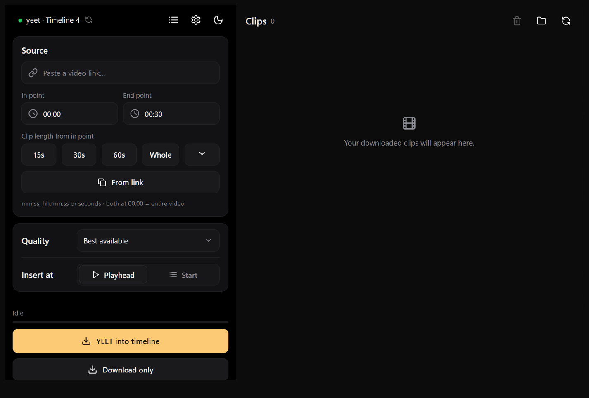

<div align="center">


# YEETingus

**Paste a link, pick a range, press YEET. The clip lands on your timeline, ready to scrub.**

For DaVinci Resolve and Premiere Pro.


</div>

---

## 🎯 What it does

You're editing, you need 20 seconds of some video you have the right to use (your own upload, something openly licensed, press material). The usual dance is: download the whole thing, trim it, convert it, import it, drag it onto the timeline.

YEETingus does that in one go. It downloads only the part you asked for, converts it into a file your editor scrubs through instantly, and puts it at your playhead. The clip stays in your history, so you can drop it in again later, play it, or copy the link.



## ✨ What's in the box

**Clipping**
- Only the part you want. Frame-accurate in and out points.
- Type `90`, `1:30` or `00:01:30`. Or hit `15s`, `30s`, `60s`, `Whole`, or drag the slider.
- Paste a link with `?t=` in it and the in point fills itself.
- Age-restricted video? The preview tells you before you waste a download.
- Working on one video? Type a **Bin** name (say `Friday video`, or hit **Today** for today's date) and everything you grab lands in its own folder until you change it, and in a bin of the same name in your editor's Media Pool or project.

**Queue**
- Flip the **Queue** switch and the YEET button becomes **Add to queue**. Paste a link, add it, paste the next one.
- Up to three download at the same time, each with its own progress bar, above your clips list. Stop or remove any of them.
- Queued clips are download-only, so they don't land on your timeline in whatever order they happen to finish. YEET them from the history when you're ready, one at a time or in bulk.
- A download that hiccups gets one automatic retry.

**Editors**
- Insert at the playhead or at the start of the timeline.
- The status pill shows your project and timeline (or sequence), and what's missing if something is.
- **Download only** works with no editor open at all.
- **Frame rate** in Settings decides what happens when a clip's rate differs from the timeline's: **Sharp** or **Blend** converts it here, once, so the editor never retimes it; **Optical Flow** (Resolve) keeps the file and lets Resolve retime it smoothly; **Off** leaves it alone.

**Quality**
- Up to 4K. The app checks what the video actually offers and says so.
- Every download becomes an editing intermediate with a keyframe every half second. That's why scrubbing feels instant. Your GPU does the encoding (AV1 for Resolve, HEVC for Premiere), the CPU if you have no encoder.

**History**
- Everything you've ever clipped, newest first, with thumbnail, title, bin, channel, length, size, date.
- Per clip: YEET it again, play it, copy the link, open its folder.
- Bulk insert and bulk delete with checkboxes: tick several clips and YEET them into the timeline in order, or remove them from disk.
- Click a title or channel to copy it. Click a bin to show only that bin's clips.

**Language**
- English or Polish (Settings → Language, or Auto to follow your system).

`FEATURES.md` has the long version.

---

## 🎬 DaVinci Resolve

Works with **Resolve Studio** and **Resolve Free**. Studio needs no extra clicks. Free needs one click per Resolve session.

**Studio.** Turn scripting on once: `Preferences → System → General → External scripting using → Local`. The app tells you if it's off. Optional: Settings can add a YEETingus entry to Resolve's Scripts menu, so you can open the app from inside Resolve.

**Free.** Setup, once:

1. Settings → **Add to Resolve's Scripts menu**. Restart Resolve, which reads that menu only at startup.

Then, every time you open Resolve:

2. Start YEETingus yourself.
3. In Resolve: **Workspace → Scripts → YEETingus**. Nothing seems to happen. That's right. The bridge is now running and stays running until you quit Resolve.

### How Free works

Free has no external scripting, so no program outside Resolve can touch your timeline. Since 21.1 it also runs scripts in a sandbox: no files, no programs, no network. What's left: a Lua script started from the Scripts menu may keep running, read a file, and write Resolve's own settings file.

So the menu entry starts a small bridge script *inside* Resolve. YEETingus writes a request into a file in its own folder. The bridge picks it up within a tenth of a second, runs it with Resolve's own API, and writes the answer into Resolve's settings file, which YEETingus reads back. The steps are the same as on Studio: import, bin, playhead, first free track, retime. AutoSubs uses the same trick.

### What Free can't do

- **Start by itself.** You click the Scripts entry once per Resolve session. Nothing can start the bridge automatically. AutoSubs tried it with a startup script, and Fusion's controls broke for the whole session.
- **Open YEETingus.** Free 21.1 can't start programs, so the menu entry can't launch the app. You start it yourself. On Free 21.0 and older the entry still opens it.
- **Get past a dialog.** While a dialog is open in Resolve, the bridge waits. The insert times out after 90 seconds and tells you why.
- **Stay fixed.** Blackmagic doesn't document the sandbox. A Resolve update can close this path. If it does, **Download only** and a drag still work.
- **Handle every file name everywhere.** On Windows, names with non-Latin letters go to Resolve by their short 8.3 name. A drive without short names may refuse them.
- **Prove itself yet.** Free support is new, and the tests run it against a stand-in Resolve. If it breaks on yours, open an issue with the log.

---

## 🟪 Premiere Pro

It works. Video and audio land on V1/A1 at your playhead, same button. Getting there meant going through Adobe's extensibility platform, so, a few words.

### Setup

1. Settings → Editor → **Premiere Pro** → **Install the Premiere panel**. YEETingus packages its panel and hands it to Adobe's own plugin installer. No developer mode, no "UXP Developer Tool", no signing. Ten seconds.
2. In Premiere: **Window → UXP Plugins → YEETingus**. Dock it somewhere small and **save your workspace**. Premiere brings it back on every launch after that.
3. Have YEETingus running. The panel finds it on its own.

That's it, one time. The panel has no controls, it's just a green dot.

### About UXP 🙃

Premiere Pro has no scripting interface you can reach from outside it. None. Resolve has had one for years. Premiere offers "UXP": a JavaScript sandbox that runs *inside* Premiere, in a panel, only while that panel is open.

So every tool like this one (AutoSubs, Taperat, YEETingus) has to ship a panel whose whole job is to sit there and be a phone line. Fine. But the sandbox also can't:

- **start a program.** `shell.openExternal("yeetingus://")` says *"URI scheme yeetingus is not accepted."* `shell.openPath("YEETingus.exe")` says *"Extension .exe is not accepted."* Tested both. The panel cannot launch the app it exists to talk to. You start YEETingus yourself, like an animal.
- **be opened from outside.** No API, no command line, nothing. Hence the workspace dance.
- **use a normal DOM or CSS.** A subset with its own widgets, so nothing you already have carries over.

### About AV1 🙃🙃

It's 2026. AV1 is what YouTube serves you above 1080p, what every GPU from the last four years encodes and decodes in hardware, what Resolve has played since 18.1. YEETingus makes its intermediates in AV1 for exactly those reasons: fast to make, instant to scrub, half the size.

**Premiere Pro does not decode AV1.** Import an AV1 MP4 and you get a waveform. Audio only. No error, no warning, just quietly less video than you gave it. This is the flagship NLE of the company that sells you Media Encoder.

So when Premiere is your editor, YEETingus encodes **HEVC** instead. Same half-second keyframes, same hardware path, Premiere plays it fine. Insert an older AV1 clip from the history and it quietly makes an HEVC copy first. You won't notice. Adobe should.

---

## 📋 Requirements

| | |
|---|---|
| OS | Windows 10/11, or macOS on Apple Silicon |
| DaVinci Resolve | **Studio** with `External scripting using → Local`, or **Free** with the Scripts-menu click (see above) |
| Premiere Pro | Any version with UXP (25 or newer; tested on 26.3), plus Creative Cloud desktop for its plugin installer |
| yt-dlp, ffmpeg, Deno | Fetched automatically on first run (macOS: `brew install ffmpeg`) |
| Python / Node / Rust | Only if you build from source |

---

## ⬇️ Install

Grab the [latest release](https://github.com/hajdawery/yeetingus/releases/latest) and run it. First launch asks which editor you use and walks you through the one-time setup.

### Build it yourself

```bash
git clone https://github.com/hajdawery/yeetingus.git
cd yeetingus
```

The engine is Python 3.13, the window is Tauri (Rust + Node). To run it:

```bash
py -3.13 backend/service.py --port 47591 --token dev
```

```bash
cd app && npm install && npm run tauri dev
```

To package it:

```bash
py -3.13 build.py --release
```

That gives you `dist/YEETingus-windows-x86_64.exe` (or `YEETingus-Mac-ARM.dmg`).

### On a Mac

Same steps, with `python3.13` instead of `py -3.13`. You need the python.org 3.13, Xcode's command line tools, Rust and Node:

```bash
xcode-select --install
```

```bash
brew install node ffmpeg
```

```bash
curl --proto '=https' --tlsv1.2 -sSf https://sh.rustup.rs | sh
```

```bash
python3.13 build.py --release
```

The build is ad-hoc signed, not notarised. A downloaded copy gets blocked the first time: open it once, then System Settings → Privacy & Security → Open Anyway. A copy you built yourself just opens.

Drag YEETingus into Applications before you add the Resolve menu entry in Settings, since the entry remembers where the app was.

---

## 📁 Where clips go

Your Videos folder, in a `YEETingus` subfolder, one folder per video. Fill in the **Bin** field and they go one level deeper, in `YEETingus/<bin>/`. Change the clips folder in Settings. Existing clips stay where they are, because your timelines point at them.

---

## 🔧 Troubleshooting

**Resolve is not connected.** Resolve is running, and a project and timeline are open. On Studio, `External scripting using` is Local. On Free, you clicked Workspace → Scripts → YEETingus since Resolve started. Click the status pill to re-check.

**Free: the Scripts entry does nothing, still not connected.** An entry added by an older YEETingus doesn't know the bridge. Settings offers **Update the Resolve menu entry**. Click it, then restart Resolve.

**Playback is choppy but scrubbing is fine.** Check Resolve's Project Settings → Master Settings → Playback frame rate. If it says 24 under a 60 fps timeline, that's it. The app warns about this in the log.

**Premiere panel not open.** Window → UXP Plugins → YEETingus, then save the workspace so it stays. Settings shows whether the panel is installed and whether Premiere has it open.

**Premiere imported a clip as audio only.** That's an AV1 file Premiere remembers from before. Delete the item from the Project panel and insert again from the history; you'll get an HEVC copy.

**Age-restricted.** No signed-in session, so no. The preview says so before you try.

**HTTP 403 / "no JavaScript runtime".** Settings → Update yt-dlp, and check the JS line. YouTube changes things, yt-dlp catches up within days.

**Asked for 4K, got 1080p.** The video doesn't have 4K. The app took the best it has and said so in the log.

---

## ⚠️ Known limitations

- Every clip is converted, so it takes a few seconds after the download and the file ends up bigger than the download.
- Resolve 18.1+ to play AV1 clips. Premiere gets HEVC because it can't play AV1 at all.
- HDR survives only on the GPU path; the CPU path makes it SDR.
- Macs use HEVC (VideoToolbox) for Premiere and the CPU path for Resolve. No AV1 encoder on Apple chips.
- Linux and Intel Macs: untested.
- Updates are announced in the app, not installed by it: you download and run the new installer.
- Mostly tested with YouTube, Twitch and X.

---

## ⚖️ Legal

YEETingus is for media you have the right to use: your own uploads, openly licensed material, and promotional media made available for creator, press or editorial use. Downloading other videos may break the terms of the site you got it from, and the copyright stays with whoever owns it.

Fair use / fair dealing can cover commentary, criticism, review, teaching and the like, but the rules depend on where you are. YEETingus doesn't give you permission to use anything.

**You're responsible for what you download and publish. Credit your sources.**

No telemetry, no analytics, no accounts. The app only talks to the internet to fetch yt-dlp, ffmpeg and Deno, to the site of the link you pasted, and to GitHub to see whether a newer YEETingus is out (turn that off in Settings). Everything between the window, the service and the Premiere panel stays on your machine.

DaVinci Resolve, Blackmagic Design, Adobe, Premiere Pro, YouTube, Twitch, macOS, Apple Silicon and Windows belong to their owners. YEETingus is an independent project, not affiliated with or endorsed by any of them. The opinions about their extensibility platforms are mine, and earned.

---

## 📄 License

MIT. See `THIRD-PARTY-NOTICES.md` before redistributing a build. The licence doesn't cover content you download with it, or third-party bits inside a build.

---

## 🙏 Credits

- [yt-dlp](https://github.com/yt-dlp/yt-dlp) for the downloading
- [ffmpeg](https://ffmpeg.org/) for trimming, merging and conversion
- [AutoSubs](https://github.com/tmoroney/auto-subs) for the look, and for proving the panel-as-phone-line idea
- Blackmagic Design for a scripting API a program can actually call

<div align="center">

**© 2026 [haej](https://github.com/hajdawery)**

Made for editors who are tired of the download, trim, import shuffle.

</div>
